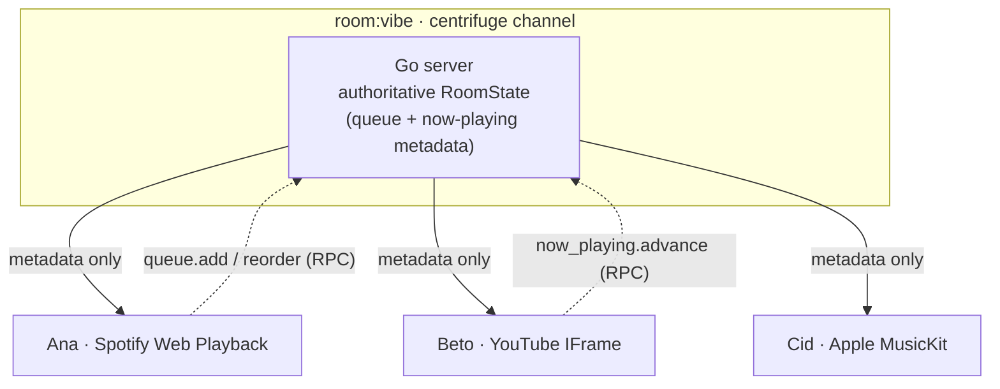

<div align="center">

# CoJam

**Friends on different streaming services, listening together in one room.**

Spotify, Apple Music, and YouTube in a single shared queue: each person plays on
their own account while the server keeps everyone in sync on metadata alone.

[](https://github.com/LucasSantana-Dev/cojam/actions/workflows/ci.yml)


</div>

## Contents

- [How it works](#how-it-works)
- [Platform support](#platform-support)
- [Architecture](#architecture)
- [Getting started](#getting-started)
- [Configuration](#configuration)
- [Testing](#testing)
- [Project layout](#project-layout)
- [Status](#status)

## How it works

CoJam lets friends in the same room listen to music together, each using their
own streaming account. A shared queue decides who plays what; the server
coordinates **metadata only, never audio**. Every listener plays the current
track on their own device through its native SDK, which preserves DRM and stays
within each platform's terms of service.

- Create or join a room by ID
- Add tracks to a shared queue (ISRC or title/artist search)
- Reorder, remove, and auto-advance on track end
- See who is listening in real time (presence)
- Cross-service track matching: ISRC first, MusicBrainz fallback, fuzzy YouTube



> [!IMPORTANT]
> CoJam follows the Stationhead / Vertigo model: per-user streams synchronized by
> metadata. It never rebroadcasts one audio stream to many listeners, the model
> that violates streaming agreements and killed turntable.fm.

## Platform support

| Platform | Status | SDK | Notes |
| --- | --- | --- | --- |
| YouTube | Supported | IFrame embed | Public API, web only |
| Spotify | Supported | Web Playback SDK | Premium per user; Dev Mode capped at 5 |
| Apple Music | Stubbed | MusicKit JS | Needs Apple Developer Program; behind a toggle |
| YouTube Music | Unsupported | — | No official API |
| Deezer | Unsupported | — | API closed to new apps since 2024 |
| Tidal | Unsupported | SDK | Full-catalog license agreement required |

> [!NOTE]
> Cross-service master offset is roughly 500ms. That is physics (different
> masters per service), not a bug.

## Architecture

| Layer | Choices |
| --- | --- |
| Frontend | Next.js 16 (App Router) · React 19 · Tailwind CSS 4 · zustand · centrifuge-js |
| Backend | Go · chi router · centrifuge realtime hub (rooms, presence, reconnect recovery) · golang-jwt |
| Matching | ISRC-first · YouTube Data API · Spotify Client Credentials · MusicBrainz fallback |
| Persistence | In-memory rooms (MVP) · PostgreSQL + sqlc/pgx planned |
| Monorepo | pnpm workspaces (`apps/web`, `packages/shared`) + colocated Go module (`apps/server`) |
| Deploy | Fly.io via Docker ([`docs/deploy.md`](docs/deploy.md)) |

One centrifuge channel serves each room (`room:<id>`). Clients subscribe to a
room to be authorized to mutate it; the server is authoritative for queue state.
RPC commands (`queue.add`, `queue.reorder`, `now_playing.advance`) each publish
the full `RoomState` on mutation. Wire protocol: [`docs/protocol.md`](docs/protocol.md).

## Getting started

> [!NOTE]
> Prerequisites: Node.js 22 with pnpm, and Go 1.26.

```bash
pnpm install
pnpm dev:server    # Go server on :8080
pnpm dev:web       # Next.js on :3000  (separate terminal)
```

Open `http://localhost:3000/room/vibe`, join with a name, and add a YouTube
track.

> [!TIP]
> Open the same room URL in a second tab to watch the queue and presence sync
> live between the two.

## Configuration

Every feature is gated behind a flag, and all match providers are optional: with
a provider's keys unset, matching is skipped silently and rooms still work with
manual track entry.

**Web** (`apps/web/.env.local`):

```bash
NEXT_PUBLIC_FEATURE_YOUTUBE=true       # default true
NEXT_PUBLIC_FEATURE_SPOTIFY=false      # default false
NEXT_PUBLIC_FEATURE_APPLE=false        # default false
NEXT_PUBLIC_FEATURE_PRESENCE=true      # default true
NEXT_PUBLIC_SPOTIFY_CLIENT_ID=<id>     # Spotify PKCE (Web Playback)
NEXT_PUBLIC_WS_URL=ws://localhost:8080/connection/websocket
```

**Server** (environment):

```bash
CORS_ORIGINS=http://localhost:3000,http://127.0.0.1:3000
FEATURE_MATCHING=true
YOUTUBE_API_KEY=<key>                  # YouTube matching
SPOTIFY_CLIENT_ID=<id>                 # Spotify matching (client credentials)
SPOTIFY_CLIENT_SECRET=<secret>
APPLE_TEAM_ID=<team>                   # Apple MusicKit token (when enabled)
APPLE_KEY_ID=<id>
APPLE_PRIVATE_KEY_PATH=/path/to/key
```

## Testing

```bash
pnpm test:server                       # Go: go test -race ./...
pnpm --filter web exec vitest run      # web unit
pnpm --filter web exec playwright test # web e2e (two-browser room sync)
```

## Project layout

```text
cojam/
├── apps/
│   ├── web/              # Next.js 16 frontend (app/, lib/, e2e/)
│   └── server/           # Go server (cmd/server, internal/hub|match|queue|obs)
├── packages/shared/      # TS protocol types: TrackRef, RoomState
├── docs/                 # ADRs, protocol, deploy runbook
└── pnpm-workspace.yaml
```

## Status

Greenfield MVP (started 2026-07-16), built in public.

- Rooms, shared queue, presence, auto-advance, YouTube playback (MVP core)
- Per-room authorization and Spotify server-side matching (Phase 3)
- Planned: Postgres durability, Fly.io deploy, Apple Music (pending Developer Program)

The Go server emits structured JSON logs to stdout and Prometheus metrics at
`/metrics`. Implementation plan lives in [`.claude/plans/`](.claude/plans/);
architecture decisions in [`docs/adr/`](docs/adr/).
