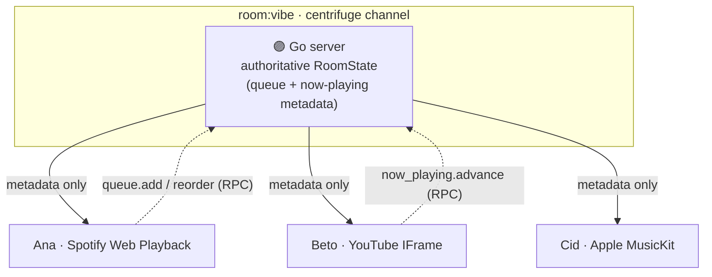

<div align="center">

# 🎧 Cojam

**Friends on different streaming services, listening together in one room.**

Spotify, Apple Music, and YouTube in the same shared queue: each person plays on
their own account, the server keeps everyone in sync on metadata alone.

[](https://github.com/LucasSantana-Dev/cojam/actions/workflows/ci.yml)


</div>

---

## ✨ What is it?

Cojam lets friends in the same room listen to music together, each using their
own streaming account. A shared queue syncs who plays what; the server
coordinates **metadata only, never audio**. Each listener plays on their own
device through their native SDK, preserving DRM and respecting platform TOS.

- 🎵 Create or join a room by ID
- ➕ Add tracks to a shared queue (ISRC or title/artist search)
- ↕️ Reorder, remove, and auto-advance on track end
- 👥 See who is listening in real time (presence)
- 🔀 Cross-service track matching (ISRC first, MusicBrainz fallback, fuzzy YouTube)

## 🔁 How the sync works

The server never touches audio. It holds the authoritative queue and now-playing
**metadata**, publishes it to everyone in the room, and each client plays that
track on its own platform SDK.



This is the **Stationhead / Vertigo model**. The opposite approach,
rebroadcasting one audio stream to many listeners, is what killed turntable.fm:
it violates streaming agreements. Cojam never does it.

## 🎛️ Platform support

| Platform | Status | SDK | Notes |
| --- | --- | --- | --- |
| YouTube | ✅ Day 1 | IFrame embed | Public API, web only |
| Spotify | ✅ Phase 1 | Web Playback SDK | Premium per user; Dev Mode capped at 5 |
| Apple Music | 🚧 Deferred | MusicKit JS | Needs Apple Developer Program; code stubbed behind a toggle |
| YouTube Music | ⛔ Unsupported | — | No official API |
| Deezer | ⛔ Unsupported | — | API closed to new apps since 2024 |
| Tidal | ⛔ Unsupported | SDK | Full-catalog license agreement required |

> Cross-service master offset is ~500ms baseline. That's physics (different
> masters per service), not a bug.

## 🏗️ Architecture & stack

| Layer | Choices |
| --- | --- |
| **Frontend** | Next.js 16 (App Router) · React 19 · Tailwind CSS 4 · zustand · centrifuge-js |
| **Backend** | Go · chi router · centrifuge realtime hub (rooms, presence, reconnect recovery) · golang-jwt |
| **Matching** | ISRC-first · YouTube Data API · Spotify Client Credentials · MusicBrainz fallback |
| **Persistence** | In-memory rooms (MVP) · PostgreSQL + sqlc/pgx planned |
| **Monorepo** | pnpm workspaces (`apps/web`, `packages/shared`) + colocated Go module (`apps/server`) |
| **Deploy** | Fly.io via Docker (see [`docs/deploy.md`](docs/deploy.md)) |

**Realtime model:** one centrifuge channel per room (`room:<id>`). Clients
subscribe to a room to be authorized to mutate it; the server is authoritative
for queue state. RPC commands (`queue.add`, `queue.reorder`,
`now_playing.advance`) each publish the full `RoomState` on mutation. Protocol:
[`docs/protocol.md`](docs/protocol.md).

## 📁 Layout

```text
cojam/
├── apps/
│   ├── web/              # Next.js 16 frontend
│   │   ├── app/          # App Router pages
│   │   ├── lib/          # features, auth, realtime, matching
│   │   └── e2e/          # Playwright tests
│   └── server/           # Go server
│       ├── cmd/server/   # main.go, router, centrifuge
│       └── internal/     # hub, match, queue, appletoken, obs
├── packages/shared/      # TS protocol types: TrackRef, RoomState
├── docs/                 # ADRs, protocol, deploy runbook
└── pnpm-workspace.yaml
```

## 🚀 Getting started

**Prerequisites:** Node.js 22 + pnpm, Go 1.26.

```bash
pnpm install
pnpm dev:server    # Go server on :8080
pnpm dev:web       # Next.js on :3000  (separate terminal)
```

Open `http://localhost:3000/room/vibe`, join with a name, add a YouTube track,
then open the same URL in a second tab to watch the queue sync live.

<details>
<summary><b>Environment variables</b></summary>

**Web (`apps/web/.env.local`)** — every feature is behind a flag:

```bash
NEXT_PUBLIC_FEATURE_YOUTUBE=true       # default true
NEXT_PUBLIC_FEATURE_SPOTIFY=false      # default false
NEXT_PUBLIC_FEATURE_APPLE=false        # default false
NEXT_PUBLIC_FEATURE_PRESENCE=true      # default true
NEXT_PUBLIC_SPOTIFY_CLIENT_ID=<id>     # Spotify PKCE (Web Playback)
NEXT_PUBLIC_WS_URL=ws://localhost:8080/connection/websocket
```

**Server (env)** — all match providers are optional; unset keys disable matching
silently and rooms still work with manual track entry:

```bash
CORS_ORIGINS=http://localhost:3000,http://127.0.0.1:3000
FEATURE_MATCHING=true
YOUTUBE_API_KEY=<key>                  # YouTube matching
SPOTIFY_CLIENT_ID=<id>                 # Spotify matching (client credentials)
SPOTIFY_CLIENT_SECRET=<secret>
APPLE_TEAM_ID=<team>                   # Apple MusicKit token (when enabled)
APPLE_KEY_ID=<id>
APPLE_PRIVATE_KEY_PATH=/path/to/key
```

</details>

## 🧪 Testing

```bash
pnpm test:server                       # Go: go test -race ./...
pnpm --filter web exec vitest run      # web unit
pnpm --filter web exec playwright test # web e2e (two-browser room sync)
```

## 🗺️ Status & roadmap

Greenfield MVP (started 2026-07-16), built in public.

- ✅ **Rooms, queue, presence, auto-advance, YouTube playback** (MVP core)
- ✅ **Per-room authorization + Spotify server matching** (Phase 3 S1)
- 🚧 **Postgres durability, Fly.io deploy, Apple Music** (needs Developer Program)

Observability: the Go server emits structured JSON logs to stdout and Prometheus
metrics at `/metrics`. Plan lives in
[`.claude/plans/`](.claude/plans/); decisions in [`docs/adr/`](docs/adr/).

## 📄 License

MIT (placeholder, pending confirmation).
