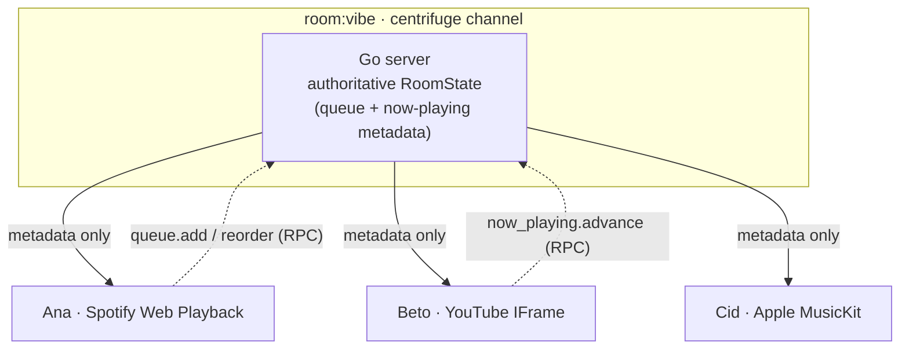

<div align="center">

# CoJam

**Friends on different streaming services, listening together in one room.**

Spotify, Apple Music, and YouTube in a single shared queue: each person plays on
their own account while the server keeps everyone in sync on metadata alone.

[](https://github.com/LucasSantana-Dev/cojam/actions/workflows/ci.yml)


</div>

## Contents

- [How it works](#how-it-works)
- [Platform support](#platform-support)
- [Architecture](#architecture)
- [Getting started](#getting-started)
- [Configuration](#configuration)
- [Testing](#testing)
- [Deploying](#deploying)
- [Project layout](#project-layout)
- [Status](#status)

## How it works

CoJam lets friends in the same room listen to music together, each using their
own streaming account. A shared queue decides who plays what; the server
coordinates **metadata only, never audio**. Every listener plays the current
track on their own device through its native SDK, which preserves DRM and stays
within each platform's terms of service.

- Create or join a room by ID
- Add tracks to a shared queue (ISRC or title/artist search)
- Reorder, remove, and auto-advance on track end
- See who is listening in real time (presence)
- Cross-service track matching: ISRC first, MusicBrainz fallback, fuzzy YouTube


```mermaid
flowchart TB
  S["Go server<br/>authoritative RoomState<br/>(queue + now-playing metadata)"]
  subgraph Room["room:vibe · centrifuge channel"]
    S
  end
  S -- "metadata only" --> A["Ana · Spotify Web Playback"]
  S -- "metadata only" --> B["Beto · YouTube IFrame"]
  S -- "metadata only" --> C["Cid · Apple MusicKit"]
  A -. "queue.add / reorder (RPC)" .-> S
  B -. "now_playing.advance (RPC)" .-> S
```

> [!IMPORTANT]
> CoJam follows the Stationhead / Vertigo model: per-user streams synchronized by
> metadata. It never rebroadcasts one audio stream to many listeners, the model
> that violates streaming agreements and killed turntable.fm.

## Platform support

| Platform | Status | SDK | Notes |
| --- | --- | --- | --- |
| YouTube | Supported | IFrame embed | Public API, web only |
| Spotify | Supported | Web Playback SDK | Premium per user; Dev Mode capped at 5 |
| Apple Music | Stubbed | MusicKit JS | Needs Apple Developer Program; behind a toggle |
| YouTube Music | Unsupported | — | No official API |
| Deezer | Search/identity (default) | — | Keyless public search API; playback SDK closed to new apps since 2024 |
| Tidal | Unsupported | SDK | Full-catalog license agreement required |

> [!NOTE]
> Cross-service master offset is roughly 500ms. That is physics (different
> masters per service), not a bug.

## Architecture

| Layer | Choices |
| --- | --- |
| Frontend | Next.js 16 (App Router) · React 19 · Tailwind CSS 4 · zustand · centrifuge-js |
| Backend | Go · chi router · centrifuge realtime hub (rooms, presence, reconnect recovery) · golang-jwt |
| Matching | ISRC-first · YouTube Data API · Spotify Client Credentials · MusicBrainz fallback |
| Persistence | Postgres (pgx) when `DATABASE_URL` is set, rooms survive restart · in-memory fallback for local dev |
| Monorepo | pnpm workspaces (`apps/web`, `packages/shared`) + colocated Go module (`apps/server`) |
| Deploy | Docker images published to GHCR when app sources change on main (`ghcr.io/lucassantana-dev/cojam-web`, `ghcr.io/lucassantana-dev/cojam-server`); self-hosted behind a reverse proxy, see [Deploying](#deploying) |

One centrifuge channel serves each room (`room:<id>`). Clients subscribe to a
room to be authorized to mutate it; the server is authoritative for queue state.
RPC commands (`queue.add`, `queue.reorder`, `now_playing.advance`) each publish
the full `RoomState` on mutation. Wire protocol: [`docs/protocol.md`](docs/protocol.md).

## Getting started

> [!NOTE]
> Prerequisites: Node.js 22 with pnpm, and Go 1.26.

```bash
pnpm install
pnpm dev:server    # Go server on :8080
pnpm dev:web       # Next.js on :3000  (separate terminal)
```

Open `http://localhost:3000/room/vibe`, join with a name, and add a YouTube
track.

> [!TIP]
> Open the same room URL in a second tab to watch the queue and presence sync
> live between the two.

## Configuration

Every feature is gated behind a flag, and all match providers are optional: with
a provider's keys unset, matching is skipped silently and rooms still work with
manual track entry.

**Web** (`apps/web/.env.local`):

```bash
NEXT_PUBLIC_FEATURE_YOUTUBE=true       # default true
NEXT_PUBLIC_FEATURE_SPOTIFY=false      # default false
NEXT_PUBLIC_FEATURE_APPLE=false        # default false
NEXT_PUBLIC_FEATURE_PRESENCE=true      # default true
NEXT_PUBLIC_SPOTIFY_CLIENT_ID=<id>     # Spotify PKCE (Web Playback)
NEXT_PUBLIC_WS_URL=ws://localhost:8080/connection/websocket
```

`NEXT_PUBLIC_*` are inlined at build time. A deployed image is configured at
runtime instead, via `COJAM_*` vars served through `/env.js` (no rebuild):

```bash
COJAM_WS_URL=wss://example.com/connection/websocket
COJAM_FEATURE_<NAME>=true|false        # runtime override per feature flag
COJAM_SUPABASE_URL=<url>               # accounts; emitted only with the anon key
COJAM_SUPABASE_ANON_KEY=<key>
COJAM_FEATURE_SUPABASE_AUTH=false      # suppress the Supabase pair entirely
COJAM_FEATURE_TELEMETRY=true           # client error/vitals/event reporting (default off)
```

> [!IMPORTANT]
> The client treats the presence of the Supabase pair as "accounts available".
> Set `COJAM_FEATURE_SUPABASE_AUTH=false` whenever the server runs with
> `FEATURE_SUPABASE_AUTH=false`, or the UI offers a sign-in the server will
> refuse.

**Server** (environment):

```bash
APP_ENV=production                     # strict config validation; refuses unsafe boots
CORS_ORIGINS=http://localhost:3000,http://127.0.0.1:3000
FEATURE_MATCHING=true
ROOM_IDLE_TTL_MINUTES=30               # evict memberless rooms idle this long
ROOM_PERSIST_IDLE_TTL_MINUTES=0        # delete memberless room ROWS idle this long (0=disabled, opt-in; single-instance only)
YOUTUBE_API_KEY=<key>                  # YouTube matching
SPOTIFY_CLIENT_ID=<id>                 # Spotify matching (client credentials)
SPOTIFY_CLIENT_SECRET=<secret>
APPLE_TEAM_ID=<team>                   # Apple MusicKit token (when enabled)
APPLE_KEY_ID=<id>
APPLE_PRIVATE_KEY_PATH=/path/to/key
SPOTIFY_TOKEN_KEY=<base64 32 bytes>    # seals stored Spotify refresh tokens
```

> [!IMPORTANT]
> `SPOTIFY_TOKEN_KEY` must be base64 of exactly 32 bytes
> (`openssl rand -base64 32`) and must be kept **separate from
> `DATABASE_URL`**, so leaking one does not imply leaking the other. Unset
> means no server-side custody: playback still works for the lifetime of one
> access token, then the user reconnects. Refusing is deliberate, because
> storing a long-lived credential in the clear is worse than not storing it.

## Testing

```bash
pnpm test:server                       # Go: go test -race ./...
pnpm --filter web exec vitest run      # web unit
pnpm --filter web e2e                  # web e2e (two-browser room sync)
```

> [!NOTE]
> The migration, store, and room-reload tests need a real Postgres and skip
> silently without one. Set `TEST_DATABASE_URL` to run them:
>
> ```bash
> TEST_DATABASE_URL=postgres://user@127.0.0.1:5432/cojam_test?sslmode=disable \
>   pnpm test:server
> ```
>
> CI provides this via a Postgres service container, so these run on every PR.

<!-- Separate GitHub alert blocks; a bare blank line trips MD028. -->

> [!TIP]
> `GET /api/healthz` is the public liveness probe. It returns `{"status":"ok"}`
> and is the only health endpoint reachable through the public hostname, so it
> is what an external uptime check should target. `/healthz` and `/readyz` are
> on the server port and are not publicly routed.

<!-- Separate GitHub alert blocks; a bare blank line trips MD028. -->

> [!WARNING]
> Always use `pnpm --filter web e2e`, never raw `playwright test`. The e2e
> script frees port 3000 first; a stale dev server on :3000 makes Playwright's
> web server hang and report "0 tests". Details in
> [CONTRIBUTING.md](CONTRIBUTING.md).

## Project layout

```text
cojam/
├── apps/
│   ├── web/              # Next.js 16 frontend (app/, lib/, e2e/)
│   └── server/           # Go server (cmd/server, internal/hub|match|queue|obs)
├── packages/shared/      # TS protocol types: TrackRef, RoomState
├── docs/                 # protocol + specs; ADRs and runbooks
│                         # (launch-readiness, feature-rollout-plan, feature-flags,
│                         # backup-restore) are local-only, gitignored
└── pnpm-workspace.yaml
```

## Deploying

The published images are environment-agnostic: one build runs anywhere, and
every deployment-specific value is supplied at runtime. There is no build-time
configuration to change and no deploy workflow in this repo, by design.

CoJam runs self-hosted: a container host behind a reverse proxy that terminates
TLS and path-routes a single hostname.

- `/connection/*` and `/api/*` reach the **Go server**.
- everything else reaches the **Next.js app**, which serves `/env.js`.

The web app defines no `/api/*` routes, so the split is collision-free.

Two constraints are easy to get wrong:

1. **Publish the container ports where the proxy can reach them.** If the proxy
   dials `127.0.0.1` and the containers publish on another interface, every
   request becomes a 502 while both containers still report healthy, because
   their healthchecks probe from inside the container. This has happened.
2. **`/healthz` is not reachable through the public hostname.** It belongs to
   the Go server, and the proxy only routes `/connection/*` and `/api/*` there,
   so a public `/healthz` hits the Next.js app and 404s. Probe `/readyz` on the
   server port directly, or use `/api/connection-token` from outside.

Rollback is pinning the previous `sha-` image tag and recreating. Room state is
in Postgres and survives restarts.

> [!NOTE]
> The operator runbooks with host-specific detail (`launch-readiness.md`,
> `feature-rollout-plan.md`, `backup-restore.md`, `observability.md`) are
> local-only by repo convention and are not in this repository.

## Status

Greenfield MVP (started 2026-07-16), built in public.

- Rooms, shared queue, presence, auto-advance, YouTube playback (MVP core)
- Per-room authorization and Spotify server-side matching (Phase 3)
- Postgres durability (rooms survive restart when `DATABASE_URL` is set)
- Planned: Apple Music (pending Developer Program)

The Go server emits structured JSON logs to stdout; Prometheus metrics are
served at `/metrics` on a dedicated listener when `METRICS_ADDR` is set (never
on the public port). Architecture decisions live in `docs/adr/` (local-only).
