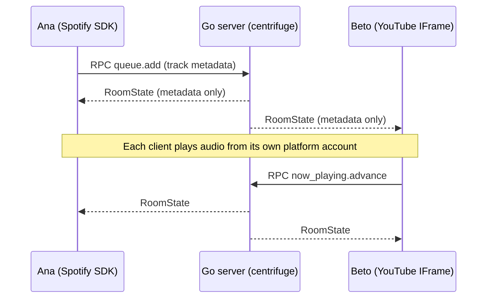

<div align="center">

# CoJam

**Friends on different streaming services, listening and watching together in one room.**

*Cada um no seu streaming, todo mundo na mesma sala.*

[](https://github.com/LucasSantana-Dev/cojam/actions/workflows/ci.yml)


[Live site](https://cojam.lucassantana.tech) · [How it works](#how-it-works) · [Run locally](#quick-start)

<!-- hero image: added with the brand refresh (#325) -->

</div>

## Why CoJam

- **Cross-service rooms.** One person on Spotify, one on YouTube, one on Apple Music (planned). Same queue.
- **Metadata only.** The server syncs the queue and playback position. It never relays audio or video.
- **Guest-first.** Type a name and you are in. No account, no install.
- **Private by link.** Every room starts private: the link is the permission. Hosts can opt a room into the public directory at `/rooms`.

## How it works

Each listener plays the current track on their own device, through the platform's official SDK. That keeps DRM intact and stays within each service's terms. The Go server holds the authoritative room state and pushes it to every client over one centrifuge channel per room.


```mermaid
sequenceDiagram
  participant A as Ana (Spotify SDK)
  participant S as Go server (centrifuge)
  participant B as Beto (YouTube IFrame)
  A->>S: RPC queue.add (track metadata)
  S-->>A: RoomState (metadata only)
  S-->>B: RoomState (metadata only)
  Note over A,B: Each client plays audio from its own platform account
  B->>S: RPC now_playing.advance
  S-->>A: RoomState
  S-->>B: RoomState
```

Cross-service offset is roughly 500 ms. Each service plays its own master recording, so this is physics, not a bug. Wire protocol: [`docs/protocol.md`](docs/protocol.md).

## What works today

| Feature | Status | Notes |
| --- | --- | --- |
| Rooms, shared queue, presence, auto-advance | Available | Reorder, remove, join by room ID |
| YouTube playback | Available | IFrame embed |
| Spotify playback | Available | Web Playback SDK, Premium per user. Web flag `NEXT_PUBLIC_FEATURE_SPOTIFY`, off by default in code |
| Track matching | Available | ISRC first, MusicBrainz fallback, fuzzy YouTube. Optional per provider |
| Postgres durability | Available | Rooms survive restart when `DATABASE_URL` is set |
| Playback sync (drift correction) | Behind a flag | `FEATURE_SYNC`, off by default |
| Chat, queue voting, public directory | Behind a flag | `FEATURE_ROOM_CHAT`, `FEATURE_QUEUE_VOTING`, `FEATURE_PUBLIC_ROOMS`, all off by default |
| Room auth tokens | Behind a flag | `FEATURE_ROOM_AUTH`, off by default |
| Video co-watch | Behind a flag | `FEATURE_VIDEO`, off by default |
| Member reports, host moderation | In `[Unreleased]` | See [CHANGELOG](CHANGELOG.md) |
| Apple Music | Stubbed | MusicKit JS, needs the Apple Developer Program |
| Screen share | Planned | [Spec](docs/specs/310-screen-share.md), private rooms only |

The web app has matching `NEXT_PUBLIC_FEATURE_*` and runtime `COJAM_FEATURE_*` flags. Full list in [`docs/configuration.md`](docs/configuration.md). Other platforms (YouTube Music, Deezer, Tidal): [`docs/platforms.md`](docs/platforms.md).

## Quick start

Prerequisites: Node.js 22 with pnpm, and Go 1.26.

```bash
pnpm install
pnpm dev:server    # Go server on :8080
pnpm dev:web       # Next.js on :3000 (separate terminal)
```

Open `http://localhost:3000/room/vibe`, join with a name, and add a YouTube track. Open the same URL in a second tab to watch the queue and presence sync.

## Stack

| Layer | Choices |
| --- | --- |
| Web | Next.js 16 (App Router), React 19, Tailwind CSS 4, zustand, centrifuge-js |
| Server | Go, chi, centrifuge hub (rooms, presence, reconnect recovery), golang-jwt |
| Matching | ISRC first, YouTube Data API, Spotify Client Credentials, MusicBrainz fallback |
| Database | Postgres (pgx) when `DATABASE_URL` is set, in-memory otherwise |
| Monorepo | pnpm workspaces (`apps/web`, `packages/shared`) plus the Go module in `apps/server` |
| Deploy | Docker images on GHCR (`cojam-web`, `cojam-server`), self-hosted behind a reverse proxy |

Self-host runbooks are local-only by repo convention. The one rule to know: the proxy sends `/connection/*` and `/api/*` to the Go server and everything else to Next.js. Details in [`docs/development.md`](docs/development.md#deploying).

## Documentation

- [`docs/configuration.md`](docs/configuration.md): env vars for web and server
- [`docs/development.md`](docs/development.md): testing, project layout, deploying, observability
- [`docs/platforms.md`](docs/platforms.md): platform support matrix
- [`docs/protocol.md`](docs/protocol.md): wire protocol
- [`docs/specs/`](docs/specs/README.md): feature specs

## Contributing

Read [CONTRIBUTING.md](CONTRIBUTING.md) first. Run `pnpm test:server` and `pnpm --filter web exec vitest run` before opening a PR.

## Security

Report vulnerabilities privately, as described in [SECURITY.md](SECURITY.md).

## License

[MIT](LICENSE)
